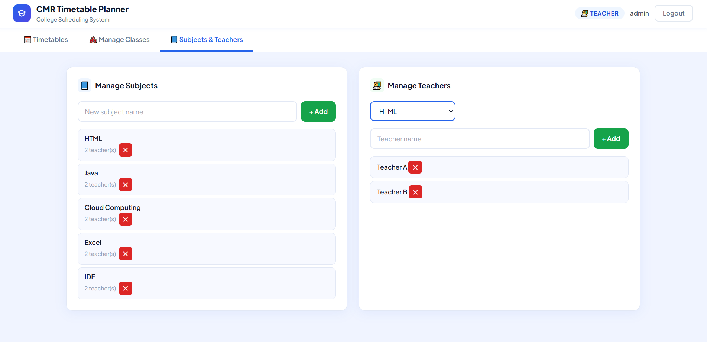
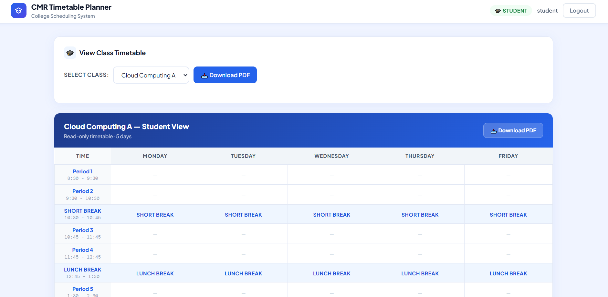

# CMR Timetable Planner


A role-based timetable management system that helps teachers create and manage class schedules efficiently. The system prevents timetable conflicts by ensuring that a teacher cannot be assigned to multiple sections at the same time slot.

## Problem Statement
Manual timetable scheduling can lead to teacher conflicts, overlapping class timings, and inefficient timetable management.

## Live Demo
[Open Project](https://alxen03.github.io/Timetable-Generator/)

## Features
- Conflict-free timetable generation
- Teacher schedule conflict prevention
- Dynamic class and section management
- Subject and teacher allocation system
- Student timetable view
- PDF timetable export
- Responsive dashboard UI
- Read-only student timetable access

## Technologies Used
- HTML
- CSS
- JavaScript

## How It Works
1. Teachers log in to the system
2. Classes and sections can be created dynamically
3. Subjects and teachers are assigned
4. Teachers generate timetables for each section
5. The system validates schedules automatically
6. If a teacher is already assigned to another section at the same time slot, the system prevents duplicate allocation
7. Students can view and download their class timetable

## Conflict Prevention Logic
If a teacher is already assigned to a section during a specific time slot, the system prevents assigning the same teacher to another section at the same time.

### Example
- HTML Teacher A is assigned to Cloud Computing A at 8:30 AM
- If the same teacher is assigned to Cloud Computing B at 8:30 AM
- The system blocks the allocation and shows a conflict warning

This prevents overlapping teacher schedules and ensures timetable accuracy.

## User Roles

### Teacher Panel
- Create and manage timetables
- Add or remove class sections
- Assign subjects and teachers
- Prevent teacher scheduling conflicts
- Export timetable as PDF

### Student Panel
- View class timetable
- Select class section
- Download timetable as PDF
- Access read-only timetable view

## Manage Classes
Teachers can dynamically create and manage sections such as:
- CC A
- CC B
- General A
- General B
- DS A
- DS B

Sections can also be renamed or removed directly from the dashboard.

## Subjects & Teachers
Teachers can:
- Add subjects
- Assign multiple teachers to subjects
- Manage subject-teacher allocation
- Organize timetable scheduling efficiently

## Challenges Faced
- Preventing teacher schedule conflicts
- Managing overlapping batch timings
- Organizing timetable structure dynamically
- Validating schedules correctly

## Problems Solved
- Prevents duplicate teacher allocation
- Avoids overlapping class schedules
- Reduces manual timetable management errors
- Simplifies timetable organization for colleges

## Key Functionalities
- Create and manage multiple sections
- Generate structured weekly timetables
- Prevent duplicate teacher allocation at the same time slot
- Export generated timetable as PDF
- Student timetable access system

## Preview

### Login Page


### Teacher Timetable Dashboard


### Manage Classes


### Subjects & Teachers


### Student Timetable View


### PDF Export Feature


## Project Structure
```bash
Timetable-Generator/
│── index.html
│── style.css
│── script.js
│── assets/
│── README.md
```

## Future Improvements
- Database integration
- Authentication system
- Admin dashboard
- Multi-department timetable support
- Cloud data synchronization
- Better timetable optimization logic

## Author
Nikhil Rejith

## License
This project is licensed under the MIT License.
