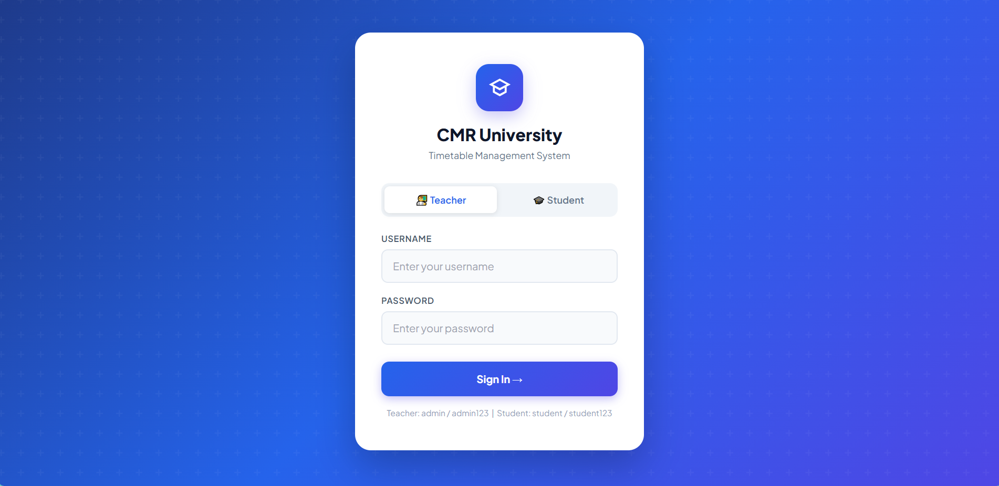
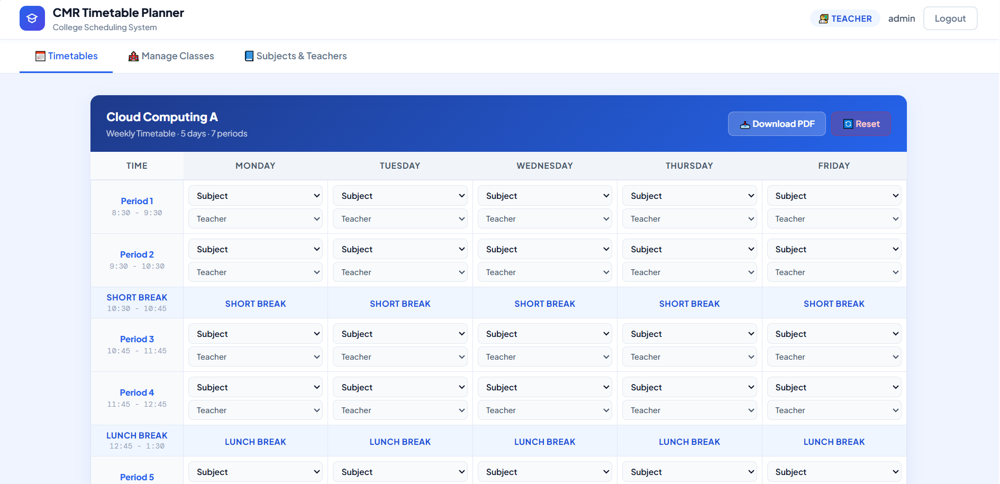
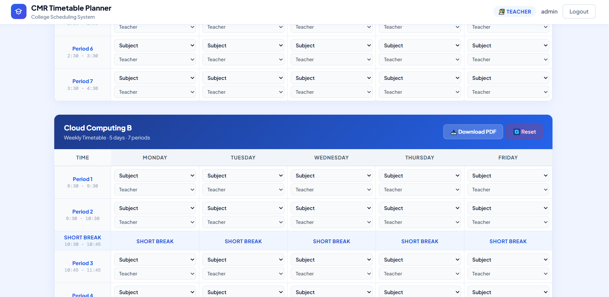
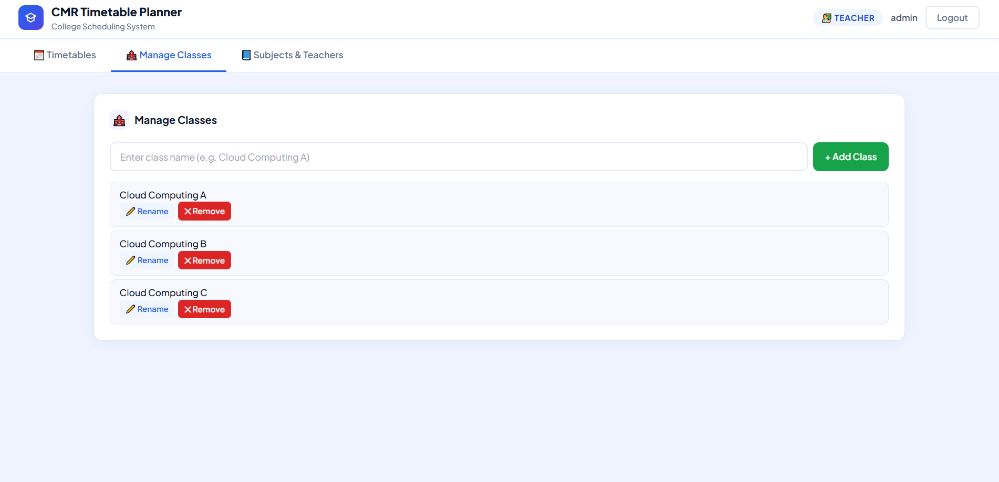

# CMR Timetable Planner

A role-based timetable management system designed to prevent scheduling conflicts between teachers and batches. The system allows teachers to manage class schedules efficiently while providing students with a clean read-only timetable view.

## Live Demo
[Open Project](https://alxen03.github.io/Timetable-Generator/)

## Features
- Conflict-free timetable generation
- Teacher schedule conflict prevention
- Batch overlap prevention
- Teacher dashboard interface
- Student timetable view
- Class management system
- Subject and teacher allocation
- PDF timetable export
- Dynamic timetable validation
- Responsive dashboard UI

## Technologies Used
- HTML
- CSS
- JavaScript

## How It Works
1. Teachers create and manage classes
2. Subjects and teachers are assigned
3. Timetables are generated dynamically
4. System validates schedules automatically
5. Teacher conflicts and overlapping batches are prevented
6. Students can access read-only timetable views
7. Timetables can be exported as PDF

## User Roles

### Teacher Panel
- Create and manage timetables
- Assign teachers and subjects
- Prevent schedule conflicts
- Manage classes dynamically
- Export timetable as PDF

### Student Panel
- View class timetable
- Access read-only schedules
- Download timetable as PDF

## Challenges Faced
- Preventing teacher schedule conflicts
- Managing overlapping batch timings
- Organizing timetable structure dynamically
- Validating schedules correctly

## Problems Solved
- Prevents teachers from being assigned to multiple classes at the same time
- Avoids overlapping batch schedules
- Reduces manual timetable management errors
- Simplifies timetable organization for colleges

## Key Functionalities
- Create and manage multiple classes
- Assign teachers to subjects
- Generate structured weekly timetables
- Prevent duplicate teacher allocation at the same time slot
- Export generated timetable as PDF

## Preview

### Teacher Dashboard


### Manage Classes


### Subjects & Teachers


### Student Timetable View


## Project Structure
```bash
Timetable-Generator/
│── index.html
│── style.css
│── script.js
│── assets/
│── README.md
```

## Future Improvements
- Database integration
- Authentication system
- Admin dashboard
- Multi-department timetable support
- Cloud data synchronization
- Better timetable optimization logic

## Author
Nikhil Rejith

## License
This project is licensed under the MIT License.
